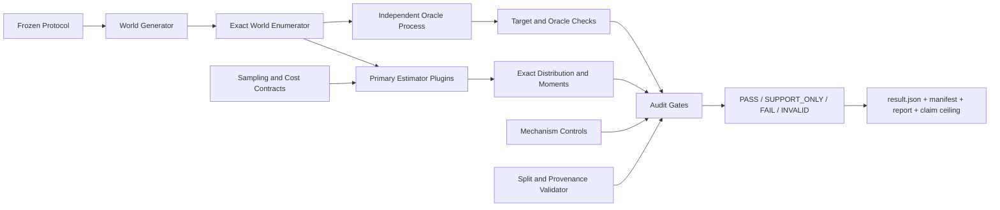

# Agent-RL Credit Auditor：详细项目设计与旧项目迁移手册

> 项目状态：`PLANNED REPACKAGING`。旧仓库已有可运行的 CPU 审计资产，但本项目尚未形成独立、干净、可发布的新仓库  
> 建议仓库：`agent-credit-auditor`（独立新仓库）  
> 文档版本：v1.0，2026-08-22  
> 目标读者：在看不到原 `grpo-credit-assignment` 仓库的电脑上重建项目的人

---

## 0. 先读结论

Agent-RL Credit Auditor 不是新的信用分配算法，而是一套 CPU-first 的**信用估计器审计与 exact benchmark 工具**。它要求每个候选方法先回答四个问题：

1. 估计对象到底是完整 policy gradient、某一决策的局部梯度、root-marginal，还是某个 continuation-specific effect？
2. 在有限可枚举世界中，相对独立 oracle 是否无偏或偏差可解释？
3. 在相同 transition/token/intervention budget 下，MSE 是否优于强基线？
4. 正结果是否真的来自声称的 adaptive/local/causal 机制，而不是退化成固定超参数或更简单控制？

项目的首个 release 应做两件事：

- 把旧 `src/credit_v2` 中可靠的 exact harness、独立 oracle、matched-cost、冻结 calibration/test 和 artifact 规范迁移到干净仓库；
- 把旧项目的 CPC、PC-RSG、RMTPG、CTRI 和 minimal logging 失败变成固定回归案例，证明 Auditor 会主动否决 target 错误、预算不公平、机制退化、环境退化或查新不成立的路线。

它与 GRPO-Guard 的关系是：

- GRPO-Guard 在线检查“轨迹是否来自正确 policy/token/mask 链路”；
- Credit Auditor 离线检查“即使轨迹正确，这个 estimator 的 target、成本和机制是否成立”。

两个项目必须独立建仓。旧 `grpo-credit-assignment` 仓库只能作为 legacy evidence museum，不能直接改名发布。

---

## 1. 项目为什么值得做

在 Agent RL 中，“更细粒度 credit”很容易得到漂亮曲线，但常见混淆包括：

- 用局部 sibling contrast 更新共享 prefix，却没有证明它仍估计完整梯度；
- 自适应选择高价值决策，却没有正支持和 Horvitz–Thompson/Hansen–Hurwitz 校正；
- 只比较单次 estimator 方差，不比较固定总预算下可以采多少次；
- baseline 用完整 rollout，候选方法却额外调用 branch oracle，成本不匹配；
- calibration/test 混用，使 selection bias 被包装成 held-out 增益；
- 平均 MSE 很好，但所谓 variable-width mapping 实际总是固定最大宽度；
- environment 的 alternatives 是 no-op，或组内 reward 没有方差；
- 理论对象正确，却只是已有 robust optimization、partial identification、functional dependency 或 hitting-set 的改名。

Credit Auditor 将这些问题变成显式 contract 和 fail-closed Gate。求职上，它能证明：你不仅会推 estimator，还能做 target definition、独立实现、精确枚举、实验预注册、固定成本、公平对照、负结果管理和 claim 边界。

---

## 2. 原 `grpo-credit-assignment` 项目全貌

本节尽量完整记录旧项目，避免新电脑因看不到仓库而误走旧路。

### 2.1 原始 CPC 设想

Credit Comparison Procurement（CPC）把 credit assignment 理解为“采购有识别力的比较”。原计划包含四级来源：

| Tier | 原计划 | 额外成本 |
|---|---|---:|
| T1 | 同一 GRPO group 中自然出现的 same-prefix siblings | 近似为零 |
| T2 | 对缺 sibling 的重要 prefix 做 restored-prefix reroll | 中等 |
| T3 | 对高影响决策做 sandbox fork，采样替代 continuation | 较高 |
| T4 | 无可识别比较时退回 global GRPO baseline | 无新增采样 |

对 prefix `p` 的 sibling rewards，旧 baseline 为：

\[
\lambda_p=\frac{n_p}{n_p+\tau},\qquad
\tilde\mu_p=\lambda_p\mu_p+(1-\lambda_p)\mu,
\]

\[
A_{\mathrm{CPC}}(i,t)=\frac{R_i-\tilde\mu_p}{\sigma}.
\]

直觉是：局部样本少时向 global baseline 收缩；siblings 增多后转向 conditional baseline。局部 advantage 原本只应作用于 action/decision tokens。

旧代码分布：

- `src/credit/prefix_tree.py`：prefix partition；
- `src/credit/aggregation.py`：precision-weighted baseline；
- `src/credit/procurement.py`：四级 procurement scaffold；
- `src/credit/token_masks.py`：action token mask；
- `src/training/train_grpo.py`：训练入口。

这些文件不随新项目一起提供，下面记录它们的失败边界，足够重建 regression fixture。

### 2.2 生产训练链路失败

旧项目的 `CPCGRPOTrainer` 在初始化时创建一次外部 rollout client，之后没有按 optimizer update 同步或重启服务模型。trainer 权重在变，rollout policy 不变。

同时存在：

- trainer 用本地模型对重编码文本计算 `old_logp`，但样本来自另一静态 policy；
- rollout 使用 messages/chat template，trainer 使用字符串拼接重新 tokenize；
- completion mask 通过最后 `comp_len` 个位置推断；
- action mask 使用第一次 `str.find(action)`；
- evaluation 未显式指定 split，实际默认 train，却被称为 dev/held-out。

因此旧 per-iteration success 不是训练后 policy 的表现。以下旧说法永久禁止：

- GRPO `36.5% → 63.5%`；
- pilot `4.7% → 10.9%`；
- 根据主表/消融 success curve 宣称 CPC 学习有效；
- 把 trainer 当前 policy 的重算 logprob 称为 behavior old-logprob。

另有两个 method-integrity 失败：

- `plan_procurement` 的 T2/T3 只被 unit tests 调用，production 只执行 T1 natural sibling；
- `cpc_alltoken` 仍把 credit 写入 action spans，不是真正的 all-token ablation。

### 2.3 环境和 oracle 失败

ALFWorld alternatives 多为可恢复 no-op：SFT 有 `53/60`、CPC-iter2 有 `43/50` fork oracle 值为 0。ToolEnv 的 per-rollout draws 只改物品/城市，不改工具序列，使同一 goal 内全成功或全失败，多个估计量恒定。

旧 `ρ=0.735` 是错误归一化造成的假方差，必须视为废弃数据。Auditor 应把“alternative 是否改变状态”“组内 estimator 是否非退化”设为前置 Gate。

### 2.4 旧生产阶段仅能保留的窄结果

| 结果 | 正确解释 |
|---|---|
| ALFWorld between-prefix variance `0.18 → 1.00` | simulation phenomenon，不是训练收益 |
| pilot KL：CPC `0.98` vs GRPO `1.31` | 单 seed、训练侧方向，不证明 credit 更好 |
| main KL：CPC `0.20` vs GRPO `0.25` | 5 seeds、方向但不显著 |
| ALFWorld fixed eval：SFT `7.3%`、GRPO `5.6%`、CPC `6.0%` | null/negative；无方法超过起点，且旧 held-out 标签错误 |
| ToolEnv fixed eval：三者均 `52.8%` | 环境退化，不是算法普遍等价 |

### 2.5 为什么转向 exact CPU harness

线上证据失效后，项目没有继续烧 GPU，而是先在可完全枚举的 finite MDP/SCM 中回答：

- estimator 的真实 estimand 是什么；
- bias、variance、MSE 是多少；
- fixed-budget 下与 dense/HH/BPO-like baseline 谁更好；
- positive result 是否来自声称机制；
- calibration 与 untouched test 是否真正隔离。

这一步形成了本新项目最应继承的资产。

---

## 3. 旧 CPU 路线的结果与失败：必须固化为回归案例

### 3.1 M0 target audit

旧 `src/credit_v2` 使用 Bernoulli action-tree 和 exact enumeration。策略按时间步独立 Bernoulli：

\[
a_t\sim\mathrm{Bernoulli}(p_t),\qquad p_t=\sigma(\theta_t).
\]

对 logit 参数，score 为：

\[
\nabla_{\theta_t}\log\pi_\theta(a_t)=a_t-p_t.
\]

terminal reward 为 `R(a_{0:H-1})` 时，普通 on-policy score gradient 为：

\[
g=\mathbb E_{\tau\sim\pi_\theta}
\left[R(\tau)\nabla_\theta\log\pi_\theta(\tau)\right].
\]

在 202 个 exact cases 中：

- restored-state local sibling estimator 在窄假设下正确估计固定时间点的局部梯度项；
- HH 和 dense-plus-HH PC-RSG 以数值精度恢复完整普通梯度；
- corrected max bias `1.45e-16`；
- independent oracle mismatch `1.94e-16`；
- literal selected/propagated BPO 对 full gradient 在 `144/202` cases 有偏；
- 但 literal BPO 在 `242/3000` fixed-budget cells 中 MSE 最低。

重要教训：有偏不等于无用；无偏也不等于固定预算最优。Auditor 必须同时报告 target、bias、variance、MSE 和 cost。

### 3.2 PC-RSG：预注册效用 Gate 失败

PC-RSG 试图用 dense backbone 加稀疏 residual correction。冻结 V001 有：

- 600 problems；
- 3000 configuration cells；
- 24,810 result rows。

结果：

- 相对 dense 的 median improvement `-23.8066`，即约 `24.81×` dense MSE；
- 相对 uniform HH 的 median improvement `-1.4116`，即约 `2.41×` HH MSE；
- oracle residual sampling distribution 在 `0/3000` cells 中击败 dense；
- global median MSE ratio `13.600`；
- residual moment calibration median relative error `4.33%`；
- sampling distribution median L1 error `0.0156`。

失败不是 q 没估准，而是 residual noise amplification 加 branch continuation cost 的结构性问题。V001 已看过后，禁止通过换 seed、cell、threshold、q 或改用更有利但不一致的成本口径来救结果；历史比较本就没有把 calibration cost 加到 PC-RSG 主预算中，已对它有利，补计只会更差。

历史 V001 protocol 的主要参数如下，供新电脑理解资产口径：

- world：independent Bernoulli decisions，normalized linear reward，加独立零均值 noise；
- horizons `{2,4,8,16,32}`；causal densities `{one,0.25,0.5,1.0}`；entropy/causal correlation `{-1,-0.5,0,0.5,1}`；reward SNR `{0.25,1,4}`；entropy layouts `{high_entropy_early, high_entropy_late}`，组合成 600 problems；
- branch budget fractions `{1/16,1/8,1/4,1/2,1}`，形成 3000 primary cells；branch width 4；uniform-floor epsilon 0.1；total transition budget multiplier 512；problem seed `20260821`；
- methods：dense oracle、literal top-entropy BPO-like、uniform/entropy-floor HH、三种 PC-RSG q、NAT-inspired reused-backbone control；“BPO-like/NAT-inspired”不代表官方 faithful implementation；
- calibration 子集：horizons `{8,16,32}`、density `{one,.25}`、rho `{-1,-.5,0}`、3 SNR、early layout；2048 draws，seeds `{1001,2003,3001}`；
- primary Gate：budget fraction `.25`，要求 median MSE improvement 至少 `.2` 且 bootstrap lower bound > 0，相对 dense 与 uniform HH；
- bootstrap：10,000 replicates，seed `424242`，单位是“每个 unique problem cell 先对 calibration seeds 聚合后的 cell”，不是 24,810 raw rows。

完整 historical config hash 应从迁移 bundle 重算；仅凭上述摘要只能做 semantic reconstruction。

新 Auditor 应把这条路线作为 `expected_fail_utility` fixture：若新版本突然把它判为成功，首先怀疑成本或 Gate 回归。

### 3.3 RMTPG D001/D002：指标成功、机制失败

D002 先用 48 calibration problems 选择 mapping，再在 192 个互斥 untouched test problems 上确认。预算以 environment transitions 计，主预算为 4096。

相对 dense optimal-constant/root-RLOO envelope：

| Budget | RMTPG cycles | Dense cycles | Median MSE ratio | 95% bootstrap CI | `<1` cases |
|---:|---:|---:|---:|---:|---:|
| 512 | 4 | 25 | `0.829747` | `[0.824431, 0.835989]` | 190/192 |
| 1024 | 9 | 51 | `0.752304` | `[0.747524, 0.757963]` | 191/192 |
| 2048 | 19 | 102 | `0.712709` | `[0.708169, 0.717715]` | 191/192 |
| 4096 | 39 | 204 | `0.694435` | `[0.690017, 0.699354]` | 192/192 |

主预算下 mean ratio `0.706105`、sample SD `0.042110`、range `[0.658620, 0.988340]`；independent oracle 最大梯度误差 `1.28e-16`，最大 bias L2 `3.90e-17`。

但 calibration 选出的 widths 是：

```text
[8, 8, 8, 8]
```

与 global K=8 control 相同，root-vs-leaf materiality 为 `0/192`。所以只能说“global K=8 在冻结 finite-MDP 下有固定成本优势”，不能说“variable-width adaptive RMTPG 有效”。

新 Auditor 必须把它作为 `metric_pass_mechanism_fail` fixture。

### 3.4 CTRI：形式诊断成立，新颖性/外推不足

Continuation Transport and Restore Identifiability（CTRI）使用 Fraction 主实现与独立 integer oracle。

U1 partial restore：

- 96 rows；
- marginal 和 paired-replay observation regimes 都保留含相反 target sign 的等价类；
- replica 能识别 replay summaries，但不能在无 bridge assumption 时识别 original-state same-noise effect sign。

U2/U3 continuation：

- false-safe `0`；
- core/oracle projection mismatch `0`；
- coordinate-box mismatch `0`；
- abstention `5/36` 与 `100/749`；
- shared-family separation `1/24` 与 `30/749`；
- 有 400 个 U2、120,000 个 U3 非 designed sign reversals，以及 33,600 个 U3 rank-reversal families。

但它映射到已有 coupled/nonrectangular robust advantage 和 cross-world partial identification，且没有 arbitrary MDP 或真实 Agent utility。因此只作为 support-only 诊断，不作为新理论/算法。

### 3.5 Minimal logging：10/10 Gate 通过仍然 kill

旧 minimal logging 在 eight-model、three-bit、unit-cost finite universe 中枚举：

- total assignments `390625`；
- constant-sign excluded `513`；
- eligible `390112`；
- 10/10 frozen gates PASS；
- fiber/cover mismatch `0`；
- core/oracle mismatch `0`；
- sign 比 point 更易识别：`14880/390112 = 3.8143%`；
- sign-compressible：`16416/390112 = 4.2080%`；
- 仍需全部三位：`373696/390112 = 95.7920%`；
- runtime `198.63` CPU seconds，GPU 0。

查新后发现它等价于 decision-relative discernibility / functional dependency / hitting set / decision reduct；sign 只是 label coarsening。所以数学与实现正确不等于新颖。新 Auditor 可将它作为可选 telemetry-schema 教学插件，但 README 必须写出经典对应关系。

### 3.6 当前可信测试状态

2026-08-22 在旧 dirty worktree、禁止写 bytecode 的条件下重跑：

- `src/credit_v2`：28 tests PASS，约 1.3 秒；
- `src/credit_transport`：12 tests PASS；
- `src/minimal_logging`：16 tests PASS，约 0.2 秒；
- 合计 56 CPU tests PASS。

这证明模块在当前环境自洽，不证明旧线上 trainer 正确、不证明真实 LLM 效用，也不解决 dirty/untracked release provenance。

---

## 4. 新项目的目标与非目标

### 4.1 v0.1 目标

1. 定义可执行的 `EstimandSpec`、`EstimatorSpec`、`SamplingSpec` 和 `CostSpec`；
2. 提供至少两个 exact worlds 和不导入主实现的 independent oracle；
3. 支持 dense、local sibling、propagated sibling、HH/HT、BPO-like、PC-RSG、fixed/global-K branching；
4. 精确计算 bias、variance、MSE 和 fixed-budget MSE；
5. 冻结并复现 M0、V001、D002 的预期结论；
6. 自动识别 target mismatch、zero support、wrong correction、unmatched cost 和 mechanism collapse；
7. 生成机器可读 report、claim ceiling 和 failure reason；
8. clean install、CPU-only 一键复现，不依赖旧模型或 Agent 环境。

### 4.2 非目标

- 重新声称 CPC/PC-RSG/RMTPG 是新 SOTA 方法；
- 用 synthetic exact MDP 证明真实 LLM Agent 下游收益；
- 仅凭 56 个旧 tests 宣称发布完成；
- 把 CTRI 或 minimal logging 包装成新理论；
- v0.1 连接真实 GRPO GPU trainer；
- 自动完成全面 literature novelty review；
- 把一个 estimator 的低 MSE 解释成最终 task reward 一定提升。

---

## 5. 核心形式化对象

### 5.1 轨迹与普通策略梯度

对有限 horizon MDP：

\[
\tau=(s_0,a_0,\ldots,s_H),\quad
P_\theta(\tau)=\rho(s_0)\prod_{t=0}^{H-1}
\pi_\theta(a_t\mid s_t)P(s_{t+1}\mid s_t,a_t).
\]

terminal-return objective：

\[
J(\theta)=\mathbb E_{\tau\sim P_\theta}[R(\tau)].
\]

score-function gradient：

\[
g_{\mathrm{full}}=
\mathbb E\left[R(\tau)
\sum_{t=0}^{H-1}\nabla_\theta\log\pi_\theta(a_t\mid s_t)
\right].
\]

### 5.2 必须区分的 estimands

| ID | 对象 | 典型误用 |
|---|---|---|
| `FULL_SCORE_GRADIENT` | 完整 on-policy score gradient | 用单个 local contrast 无校正地代表它 |
| `LOCAL_DECISION_GRADIENT(t,s)` | 固定 state/time 的局部 action effect × local score | 传播到共享 prefix |
| `ROOT_MARGINAL_GRADIENT` | 对 root/shared parameter 的边际梯度 | 与 flat leaf average 混同 |
| `CONTINUATION_SPECIFIC_EFFECT(kappa)` | 固定 continuation policy 下的 action value/effect | 换 continuation 后仍称同一 credit |
| `ORIGINAL_STATE_SAME_NOISE_EFFECT` | 原状态、同 latent noise 的 cross-world effect | 用 independent replicas 直接识别 |
| `CLIPPED_SURROGATE_GRADIENT` | PPO/GRPO clipping 后的优化目标 | 用 unclipped exact 结果外推 |

每个实验只能有一个 primary estimand；secondary estimands 必须另列，不能在看到结果后切换 headline。

### 5.3 local sibling contrast

在同一 prefix/state 下比较动作 `a` 与 sibling `a'` 的 continuation return，可形成局部 contrast：

\[
\Delta_t=R(a_t,\xi)-R(a'_t,\xi'),
\]

其是否无偏取决于 continuation protocol、coupling、sampling law 和目标。最安全的窄用法是只更新被比较的 branch action score：

\[
\hat g_{\mathrm{local},t}=\Delta_t
\nabla_\theta\log\pi_\theta(a_t\mid s_t).
\]

未经证明，不得把同一个 `\Delta_t` 传播给已经共享的 prefix actions。

### 5.4 HH/HT correction

若以概率 `q_t>0` 抽取决策时间 `T=t`，对目标分量 `h_t`，单次 Hansen–Hurwitz 型估计可写成：

\[
\hat g_{\mathrm{HH}}=\frac{h_T}{q_T}.
\]

若无放回抽样，则应使用与 inclusion probability 匹配的 Horvitz–Thompson 形式。Auditor 不允许：

- `q_t=0` 但目标该分量非零；
- 使用归一化 heuristic score 却不记录实际采样概率；
- 有放回/无放回协议与校正公式不一致；
- q 在看见当前 outcome 后才决定，却仍按 previsible sampling 计算。

### 5.5 exact bias、variance 和 MSE

对于离散 estimator distribution `P(ĝ=x)`：

\[
\mu=\mathbb E[\hat g],\qquad
b=\mu-g,\qquad
\mathrm{Bias}^2=\|b\|_2^2,
\]

\[
\mathrm{VarTrace}=\mathbb E\|\hat g-\mu\|_2^2,
\qquad
\mathrm{MSE}=\mathrm{Bias}^2+\mathrm{VarTrace}.
\]

在总预算 `B`、单 cycle 成本 `c` 下，可执行 cycles：

\[
n=\left\lfloor\frac{B}{c}\right\rfloor,
\qquad
\mathrm{MSE}_B=\mathrm{Bias}^2+\frac{\mathrm{VarTrace}}{n}.
\]

该式要求 `n` 个 estimator cycles 在冻结 world 下独立同分布。若 cycles 共享 dense backbone、common random numbers 或自适应状态，必须计算联合协方差或直接枚举联合 estimator，不能机械地把 variance 除以 `n`。若 estimator 有共享 calibration/backbone 成本，也应按协议扣除，不能只除以 cycle 数。

---

## 6. 系统架构



### 6.1 模块职责

| 模块 | 职责 |
|---|---|
| `worlds` | 定义有限 MDP/SCM、精确枚举 path/model |
| `estimands` | 返回形式化 target，不依赖 estimator |
| `estimators` | 给定 world/sampling protocol 产生 estimator distribution |
| `oracles` | 独立算法/进程计算 target 和关键投影 |
| `sampling` | q、支持集、coupling、restore/continuation protocol |
| `cost` | transition/token/intervention/calibration 成本 |
| `mechanism` | fixed/global/flat 等反事实控制，检查 materiality |
| `protocol` | 冻结 config、seed manifests、thresholds、claim |
| `audit` | target、support、cost、split、mechanism、provenance Gate |
| `report` | 原始结果、claim ceiling、失败原因和限制 |
| `adapters` | 可选读取 GRPO-Guard envelope，v0.1 不依赖 GPU |

---

## 7. 核心 schema

建议使用 Pydantic v2；所有浮点结果同时保留高精度字符串或 numerator/denominator（可行时）。

### 7.1 EstimandSpec

```yaml
estimand_id: full_score_gradient
world_family: bernoulli_sequence_mdp
policy_parameterization: independent_logits
reward_semantics: terminal
continuation_policy: current_policy
state_conditioning: on_policy_marginal
clipping: none
discount: 1.0
coordinate_map_sha256: ...
```

### 7.2 SamplingSpec

```yaml
decision_sampling:
  replacement: with_replacement
  probabilities: [0.25, 0.25, 0.25, 0.25]
  probability_source: frozen_protocol
  minimum_support: 1.0e-6
restore:
  state_identity: exact
  latent_noise_coupling: independent
continuation:
  policy_identity: current_policy
  samples_per_branch: 2
correction:
  name: hansen_hurwitz
  version: v1
```

### 7.3 CostSpec

```yaml
primary_unit: environment_transition
arithmetic: rational
calculator_id: d002_branching_v1
calculator_code_sha256: ...
parameters:
  prefix_transition_cost: "1/1"
  suffix_transition_cost: "1/1"
  restore_overhead_per_extra_suffix: "1/1"
shared_costs:
  calibration_transitions: "0/1"
  calibration_cpu_seconds: report_only
  backbone_policy: included_in_cycle_formula
amortization:
  mode: none
model_forward_cost: reported_secondary
total_budget_grid: [512, 1024, 2048, 4096]
rounding: floor_complete_cycles
infeasible_if_budget_below_cycle_cost: true
leftover_policy: reserved_dummy_no_gradient_work
```

config 不接受自由字符串表达式或 `eval`。v0.1 只内置经测试的 calculator enums：`dense_horizon_v1` 返回 `H`；`d002_branching_v1` 返回 `c_prefix*d + c_suffix*K*(H-d) + c_restore*(K-1)`。输入域固定为整数 `H>0`、`0<d<H`、`K>=1`，cost coefficients 用 `Fraction` 字符串解析，输出为带 unit 的 `CostBreakdown`。自定义 calculator 必须注册新 ID、代码 hash、unit tests 和独立手算 fixture，不能从 protocol 动态解释公式。

所有 primary cost term 必须是数值或由已注册 calculator 唯一求值，不能只写 `counted`。fixed-run、per-problem、per-cycle、per-branch 与 calibration/shared cost 分开；若要摊销 shared cost，必须预先声明分母和适用的部署次数。加总全程使用 `Fraction` 或 Decimal；只有计算 `floor(total_budget/cycle_cost)` 时取整，并在 manifest 保存精确 unused budget。`budget < cycle_cost` 时状态为 `INFEASIBLE_BUDGET`，不得除以零或跳过后参与均值。

calculator 的标准输出为：

```yaml
primary_unit: environment_transition
terms:
  - {term_id: prefix, quantity: "4/1", unit_cost: "1/1", subtotal: "4/1"}
  - {term_id: suffixes, quantity: "16/1", unit_cost: "1/1", subtotal: "16/1"}
  - {term_id: restores, quantity: "7/1", unit_cost: "1/1", subtotal: "7/1"}
total: "27/1"
```

Auditor 重新求和 term subtotals 并检查单位；plugin 不能只返回一个无法分解的 total。

不同环境无法共享“transition 相同就算力相同”的强结论，因此报告可同时给 transition、model-forward、generated-token 三种成本，但 primary unit 必须预先冻结。旧 D002 的 calibration 用 exact CPU selection，未计入每个 test problem 的 transition budget；这是明确的 legacy protocol 边界，不得泛化为“calibration 免费”。新实验应同时报告 calibration CPU 时间，并根据部署语境选择单独收费或预注册摊销。

### 7.4 EstimatorSpec

```yaml
estimator_id: hh_local_sibling
version: v1
claimed_estimand: full_score_gradient
required_observations:
  - exact_restore_state
  - branch_returns
  - logged_decision_probability
required_assumptions:
  - full_support
  - current_policy_continuation
  - unclipped_score_function
sampling_spec_sha256: ...
cost_spec_sha256: ...
```

### 7.5 AuditDecision

```yaml
claim_id: d002_global_k8_fixed_budget
claim_text: global K=8 improves finite-MDP fixed-budget MSE under protocol X
status: pass | support_only | fail | invalid
required_gates: [integrity, target_identity, independent_oracle, matched_cost, heldout_split, utility]
gate_results:
  target_identity: pass
  independent_oracle: pass
  sampling_support: pass
  matched_cost: pass
  heldout_split: pass
  utility: pass
reason_codes:
  - U001_PRIMARY_THRESHOLD_MET
claim_ceiling:
  allowed: global K=8 fixed-budget finite-MDP efficiency
  forbidden: adaptive variable-width credit assignment
```

一个实验可以产生多个 `ClaimDecision`，不能用单一 status 覆盖所有层级。D002 至少有：

```yaml
experiment_integrity: pass
claims:
  - {claim_id: global_k8_efficiency, status: pass}
  - {claim_id: variable_width_adaptivity, status: fail,
     reason_codes: [MECH001_ADAPTIVE_MAPPING_COLLAPSED_TO_GLOBAL]}
headline_decision:
  proposed_new_method_claim: fail
  retained_narrow_claim: global_k8_efficiency
```

聚合规则固定为：integrity `INVALID` 会使所有依赖该数据的 claims 变为 `INVALID`；否则每个 claim 仅按其预注册 `required_gates` 判定。更强 claim 失败，不会抹掉一个预先定义且独立满足 Gate 的窄 claim；但不得在 test 后临时创造窄 claim。`SUPPORT_ONLY` 用于形式/实现可信、但 novelty、external validity 或下游 utility 不足的 claim。

---

## 8. Exact worlds

### 8.1 `BernoulliSequenceMDP`

最小 world：

```python
@dataclass(frozen=True)
class BernoulliSequenceMDP:
    probabilities: tuple[float, ...]  # p_t
    rewards: Mapping[tuple[int, ...], float]
```

功能：

- 枚举 `2^H` action sequences；
- 计算 path probability；
- 计算 score vector `(a_t-p_t)`；
- exact true gradient；
- dense estimator distribution；
- sibling local/propagated distributions；
- BPO-like/HH/PC-RSG distributions。

首版 horizon 控制在可完整枚举范围，通常 `H≤10`。

### 8.2 root-marginal designed cases

应内置五类反例：

1. `shared_logit_predictable_width_case`：共享参数下 root marginal 与 leaf aggregation；
2. `outcome_retention_case`：只保留某 outcome 会改变 target；
3. `completion_deadline_case`：不同 continuation 长度/成本；
4. `bpo_prefix_propagation_case`：local contrast 传播到 prefix 产生 target mismatch；
5. `matched_cost_positive_case`：展示某 branching estimator 确实可能在固定成本胜出。

这组 case 防止 Auditor 变成“所有新方法都否决”的空壳；它既要发现反例，也要允许窄域正结果。

### 8.3 D002 shared-parameter world

旧 D002 主要特征：

- binary states/actions；
- 3 个共享 logits；
- 多个 horizon/stratum，旧设置含 3、5、6 类长度；
- terminal reward tables；
- branch widths `{2,4,8}`；
- mapping space 2401；
- dense optimal-constant/root-RLOO baseline envelope；
- budget grid `{512,1024,2048,4096}`；
- calibration 48、test 192；
- bootstrap resamples 10,000。

每个 bucket 有 7 个候选：1 个 dense `K=1`，以及 2 个 candidate depths × 3 个 widths `{2,4,8}`，所以四个 buckets 的 mapping space 是 `7^4=2401`，不是由三个宽度直接得到。候选顺序固定为 dense first，然后按文档列出的 depth 顺序，再按 width `2,4,8`。

旧 D002 的 cycle cost 为：

\[
c(h,d,K)=d+K(h-d)+(K-1)r,\qquad r=1,
\]

dense cost 为 `h`，一个 mapping cycle 是四个 buckets 的 cost 之和。历史 selected mapping 为 `d4_k8, d4_k8, d1_k8, d3_k8`：两个 `h=6,d=4` 各 cost 27，`h=3,d=1` cost 24，`h=5,d=3` cost 26，总 cost 104；预算 4096 可完成 `floor(4096/104)=39` cycles，unused 40。dense cycle cost 为 `6+6+3+5=20`，可完成 204 cycles，unused 16。leftover 只做 dummy/no-gradient work。

Calibration objective 是 48 problems 上 `mean(log(exact_trace_mse + 1e-18))`；tie-break 依次是 objective、cycle cost、candidate index tuple。Test 不允许重新选择 mapping。主 baseline 是每个 problem 上 `min(dense optimal-constant, dense exact root-RLOO)`，oracle per-problem best mapping 只作 upper-bound diagnostic。

CI 单位是 192 个 test problems 的 paired MSE ratios。对每个 budget，固定 seed 后有放回抽取 192 个 problem-level ratios，取 median，重复 10,000 次；报告 percentile `[2.5%,97.5%]`。主预算 seed 为 `17012026`，其他 budget 使用 `17012026 + budget`。这不是 trajectory-level 或 seed-level置信区间。

重建时首先实现最小版本并通过 independent Bellman oracle，再迁移完整 protocol。不可用最终 test set 调 mapping。若没有 legacy generator/source bundle，只能建立新的 semantic reconstruction protocol，不能宣称复现了上述历史数值；具体边界见 §13.6。

#### 8.3.1 历史 D002 generator 摘要

以下信息足以重建 world generation 语义，但不能替代原 source/golden fixtures 的字节级迁移验证：

- `HashStream(key)` 的第 `i` 个 uniform draw：计算 `sha256(key_utf8 + b"::" + ascii(i))`，取 digest 前 8 bytes 按 big-endian 无符号整数解释，再除以 `2^64`；
- problem key：`"RMTPG_D002_v1::<problem_seed>"`；
- `randbelow(n)=min(n-1, int(uniform01()*n))`；shuffle 为从尾到头的 Fisher–Yates，随机数也取同一 stream；
- 先为 3 个 shared logits 各抽 `Uniform(0.15,0.85)`；
- 每个 bucket、每个 time/state 按顺序抽 base `Uniform(0.2,0.8)`、offset `Uniform(-0.1,0.1)`、effect `Uniform(-scale_t,+scale_t)`，然后
  `p(s'=1|s,a)=clip(base+offset+(2a-1)effect,0.05,0.95)`；
- 一个 bucket 的 transitions 全部生成后，再依次抽 initial binary state、parameter map、terminal reward table；
- parameter map 先放 `[0,1,2]`，再为剩余 `2H-3` positions 各抽一个 `{0,1,2}`，Fisher–Yates shuffle 后每两个值组成一个 time 的 state-0/state-1 参数索引，保证每个 shared logit 至少出现一次；
- terminal table 对 `(state, action, next_state)` 的 8 个 entries 各抽 Bernoulli(0.5)；若 8 个值全相同，确定性翻转最后一个；
- buckets：`late_reusable(H=6, depths=2/4, scales=.05,.05,.05,.05,.30,.35)`；`early_sensitive(H=6, depths=2/4, scales=.35,.30,.08,.08,.05,.05)`；`short_mixed(H=3, depths=1/2, scales=.20,.20,.20)`；`medium_mixed(H=5, depths=1/3, scales=.10,.30,.15,.30,.20)`；
- calibration/test seed `i` 分别由 `sha256("RMTPG-D002-v1::calibration::<i>")` 或 `...::test::<i>` 的前 8 bytes 对 `2147483647` 取模产生，数量 48/192。

历史正式运行使用的是补全 generator draw order 后的 superseding protocol，SHA-256 为 `ad6544d31532657c9a2a849d9a90ed2f800fe2fda05685343bdbb067a5d3fc9e`；更早的 `a615...` 是 pre-implementation 初稿，缺 `transition_base_range` 等澄清，不能拿来单独复跑最终 D002。

### 8.4 continuation/partial-restore finite worlds

作为 optional `support_only` pack：

- response functions 用 exact Fraction；
- 区分 marginal observation 与 paired replay observation；
- 计算同一 observable fiber 中 target sign 集；
- 若同时含正负 sign，则不能识别；
- continuation family 计算 action values、sign/rank stability；
- coordinate-box relaxation 与 coupled family 分开。

不要从有限枚举直接外推真实 Agent prevalence。

### 8.5 minimal telemetry universe

作为 optional teaching/plugin：

- 8 个 model rows，对应 3-bit states；
- logging schema 是 bit/channel subset；
- point/sign labels；
- observation fibers；
- different-label conflict pairs；
- 最小 cost schema = hitting set / decision reduct。

文档必须明确其经典等价，不得宣称新理论。

---

## 9. Estimator plugin contract

### 9.1 接口

```python
class EstimatorPlugin(Protocol):
    spec: EstimatorSpec

    def exact_distribution(
        self,
        world: ExactWorld,
        sampling: SamplingSpec,
    ) -> tuple[WeightedVector, ...]: ...

    def cycle_cost(
        self,
        world: ExactWorld,
        sampling: SamplingSpec,
        cost: CostSpec,
    ) -> CostBreakdown: ...  # exact value + unit + term-level quantities

    def mechanism_signature(self) -> Mapping[str, object]: ...
```

plugin 不允许直接调用 target oracle。estimator distribution 与 oracle target 必须由不同模块产生。

### 9.2 v0.1 内置 estimator

| Estimator | 用途 | 预期审计边界 |
|---|---|---|
| Dense REINFORCE | 强基础 baseline | 无偏，单 cycle 成本可能高 |
| Optimal-constant / root-RLOO | 更强 dense envelope | baseline 实现必须 faithful |
| Local sibling | 固定时间局部 target | 不能默认代表 full gradient |
| Propagated sibling | 反例 | designed cases 中应暴露 bias |
| Uniform HH | full-gradient 稀疏抽样基线 | 需要 full support |
| Entropy/BPO-like selected | 复现选择偏差与 MSE trade-off | 不冒充官方某篇算法实现 |
| PC-RSG | expected utility failure | V001 应稳定失败 |
| Global-K branching | 窄 positive control | D002 可重现 K=8 结果 |
| Variable-width mapping | mechanism audit | D002 应检测 collapse |

“BPO-like”必须使用明确限定，除非严格对齐官方实现、版本和预算，否则不能写成对官方 BPO 的结论。

---

## 10. Independent oracle 设计

### 10.1 隔离要求

oracle 必须满足：

- 不 import `estimators` 或其 helper；
- 尽可能使用不同算法，例如主实现 path enumeration、oracle 用 Bellman recursion；
- 在独立 Python process 运行；
- 输入只接受序列化 world spec；
- 输出带 code hash、input hash 和 precision；
- test 检查 import graph isolation。

### 10.2 两类 oracle

1. `EnumerationOracle`：直接枚举轨迹并计算 `E[R score]`；
2. `BellmanGradientOracle`：动态规划 value 与 gradient，避免复用主枚举逻辑。

关键 target 至少由两者交叉验证。若 mismatch 超过预注册 tolerance，实验状态是 `INVALID`，不是“选一个更合理的结果”。

### 10.3 exact arithmetic

小型 SCM/telemetry 使用 `fractions.Fraction` 或整数缩放，避免浮点 sign 翻转。MDP 大规模枚举可用 float64，但要：

- 保存最大 absolute/relative oracle mismatch；
- 对 near-zero target 单独标记；
- sign claim 设 margin，不把 `1e-16` 当可靠正负号。

---

## 11. Audit Gates

### 11.1 T：Target Gate

检查：

- claimed estimand 是否完整定义；
- estimator expectation 是否等于 target；
- local credit 是否错误传播到 shared prefix；
- continuation policy 是否与 target 一致；
- clipped/unclipped、on/off-policy 是否混写。

Reason codes 示例：

- `T001_ESTIMAND_UNSPECIFIED`；
- `T002_BIAS_EXCEEDS_TOLERANCE`；
- `T003_LOCAL_TO_PREFIX_PROPAGATION`；
- `T004_CONTINUATION_TARGET_MISMATCH`；
- `T005_CLIPPING_SCOPE_MISMATCH`。

### 11.2 S：Sampling/Support Gate

- 所有 target-relevant decisions 有正 sampling support；
- 实际 q 被记录；
- q 在允许的信息集上 previsible；
- HH/HT 与 replacement/inclusion law 匹配；
- restore/continuation protocol 明确。

Reason codes：`S001_ZERO_SUPPORT`、`S002_Q_NOT_LOGGED`、`S003_WRONG_HH_HT_CORRECTION`、`S004_OUTCOME_ADAPTIVE_UNDECLARED`。

### 11.3 C：Cost Gate

- primary cost unit 预先冻结；
- prefix、branch、continuation、restore、calibration 是否计入；
- baseline 与候选完成相同总预算；
- incomplete cycle 如何处理；
- 没有只比较 single-cycle variance。

Reason codes：`C001_UNMATCHED_TRANSITION_BUDGET`、`C002_CALIBRATION_COST_OMITTED`、`C003_BASELINE_ENTRYPOINT_UNFAITHFUL`。

### 11.4 U：Utility Gate

报告：

- bias²、variance trace、MSE；
- fixed-budget MSE ratio；
- across-problem distribution；
- predefined threshold 与 confidence interval；
- per-stratum、worst-case 和 near-zero cases。

不能用 test 后选择的 seed/cell/threshold 重新定义成功。

### 11.5 M：Mechanism Gate

每个声称的 adaptive/local/coupled 机制必须有可观测 signature 和控制：

- variable-width：selected widths 至少有预注册 diversity，且与 global control 不同；
- root aggregation：root-vs-flat result 必须有 materiality；
- adaptive q：learned q 与 uniform/oracle q 有非零差异；
- local credit：local-only 与 all-token/propagated 对照确实作用于不同坐标；
- procurement tier：production coverage 证明 tier 被执行。

RMTPG 的 `[8,8,8,8]` 应触发 `MECH001_ADAPTIVE_MAPPING_COLLAPSED_TO_GLOBAL`，即使 MSE Gate 通过。

### 11.6 D：Data/Split Gate

- sanity/calibration/test seeds 显式；
- 文件内容和生成器 hash；
- sets 互斥；
- calibration 只能输出冻结 mapping/threshold；
- test runner 拒绝未冻结 mapping；
- canonical output no-overwrite。

### 11.7 E：Environment/Oracle Gate

- alternative admissible；
- alternative 确实改变 state 或 reachable continuation；
- continuation 使用声明 policy；
- oracle variance/unique values 超过预注册非退化门；
- timeout/invalid 与真实 reward 分开。

### 11.8 N：Novelty/Claim Gate

Auditor 不自动做完整查新，但 release report 必须留：

- formal object 的已有经典对应；
- 最近强基线；
- 是新 estimand、新 estimator、新 protocol，还是已知工具组合；
- claim ceiling。

只要 formal object 明确等价已有 decision reduct/FD/hitting set，就降为 `support_only` 或 `teaching_asset`，即使所有数值 Gate 通过。

---

## 12. 状态语义

| 状态 | 含义 |
|---|---|
| `PASS` | 在冻结 world/estimand/cost/split 下通过所有必需 Gate |
| `SUPPORT_ONLY` | 形式/实现可信，但新颖性、外推或下游效用不足 |
| `FAIL` | 预注册 target、utility、mechanism 等 Gate 失败 |
| `INVALID` | oracle mismatch、split 污染、artifact 缺失等使结果不可解释 |

这些状态属于 `claim_id`，不是整个目录的唯一标签。`FAIL` 不是软件错误；它可能是正确审计出的科学负结果。`INVALID` 才表示该 claim 依赖的实验链路无法支持结论。实验目录另有 `experiment_integrity`，release 另有 `headline_decision`；三者不能互相覆盖。

---

## 13. v0.1 回归实验包

### 13.1 Pack A：M0 target regression

目标：在 legacy-exact 模式重现 202-case target 边界；在 docs-only semantic 模式重建同类 target 反例，但不要求旧 case 数和逐项数字一致。

验收：

- dense/HH/PC-RSG 的 independent oracle mismatch 在 tolerance 内；
- local sibling 对 local estimand pass；
- propagated sibling 在 designed full-gradient cases fail；
- legacy-exact 时，bundle manifest、source/protocol/golden hashes 必须全匹配，literal selected BPO 的 biased case 数必须为 `144/202`，并满足 protocol 冻结的数值 tolerance；任何有意语义变更或无法解释的差异都必须改为新 protocol 并降级为 `docs_only_semantic/semantic_port`，不能继续叫 exact；docs-only 时只要求预注册 designed cases；
- legacy-exact 同时核对其 `242/3000` fixed-budget cells MSE winner count；semantic mode 只报告自己的预注册 cases，不借用该比例。

### 13.2 Pack B：V001 utility failure

目标：确保成本和 MSE accounting 没被后续“优化”破坏。

Legacy-exact 冻结期望：PC-RSG 相对 dense/HH 明显失败，oracle q 不应被错误报告成获胜。Docs-only semantic 模式只要求预先构造并冻结至少一个“calibration 准确但 fixed-budget utility 失败”的 case，不得把它冒充历史 V001 复现。若 legacy-exact 结果改变，先审计 protocol/hash，而不是立即宣布突破。

### 13.3 Pack C：D002 metric/mechanism split

目标：同时输出：

- `C1 fixed-budget efficiency: PASS`；
- `C2 adaptive variable-width mechanism: FAIL`；
- `global_k8_efficiency` claim：`PASS`；
- `variable_width_adaptivity` claim：`FAIL`；
- proposed adaptive-method headline：`FAIL`；
- retained claim：global K=8 finite-MDP result。

这是 Auditor 最重要的演示：总指标很好也不能覆盖机制失败。

### 13.4 Pack D：CTRI support-only

可选首版或 v0.2：复现 zero false-safe、partial identification 和 sign/rank reversal；报告 formal scope 和已有理论映射。

### 13.5 Pack E：minimal logging teaching asset

可选首版或 v0.2：复现 390,112 eligible assignments 和 10/10 gates，同时在 report 顶部显示：

```text
NOVELTY STATUS: CLASSICAL DECISION-REDUCT / FD / HITTING-SET EQUIVALENCE
CLAIM STATUS: TEACHING OR TELEMETRY-SCHEMA DIAGNOSTIC ONLY
```

### 13.6 两种重建模式：必须在开工时二选一

#### `docs_only_semantic`

适用于新电脑只能看到本设计文档的现实情况：

- 从 §5–§11 重新实现 world、estimand、oracle、cost 和 Gates；
- 新建 `reconstruction_v1` protocol、seeds、thresholds 和 golden fixtures；
- 只要求复现失败**类型**：target mismatch、utility fail、metric-pass/mechanism-fail；
- 旧 `202/600/48+192/0.694/24.81×` 只作为历史事故背景，不进入新 README 的 reproduced-results 表；
- 所有新数字从新 commit 和新 manifest 产生。

#### `legacy_exact`

只有拿到并校验一次性 legacy migration bundle 后才能启用。最低 bundle 应包含：

```text
configs/v001_phase_diagram_20260821_042226.json
configs/d002_protocol_20260821_061930.json
configs/d002_{sanity,calibration,test}_seeds_20260821_061130.json
src/credit_v2/*.py
scripts/run_d002.py
deep-experiment-logs/M0_FORMAL_VALIDATION/G001_G002_attempt_04/exact_audit.json
deep-experiment-logs/M0_FORMAL_VALIDATION/V001_attempt_01/{REPORT.md,phase_diagram.csv,phase_diagram.json}
deep-experiment-logs/M0_FORMAL_VALIDATION/RMTPG_D002_calibration_attempt_01/{calibration.json,frozen_mapping.json}
deep-experiment-logs/M0_FORMAL_VALIDATION/RMTPG_D002_test_attempt_01/{REPORT.md,test_results.json,test_rows.csv}
legacy_bundle_manifest.json
SHA256SUMS
```

其中 V001 raw JSON 约 59 MB、CSV 约 11 MB，D002 test JSON 约 3.3 MB，M0 exact audit 约 0.83 MB。设计文档中的摘要和 hash 不能替代这些 bytes。拿不到 bundle 时，Definition of Done 自动采用 `docs_only_semantic`，不把缺失 legacy files 当作工程阻塞，也不声称 exact reproduction。

截至 2026-08-22，本设计交付**没有**生成或签署上述 `legacy_bundle_manifest.json`，因此当前唯一获准模式是 `docs_only_semantic`。未来启用 `legacy_exact` 前，必须由能访问旧仓库的机器创建 bundle，给 manifest 自身计算 root SHA-256，并通过本设计文档更新、签名 release 或另一条可信带外渠道把该 root digest 交给新电脑；bundle 自己携带一个未经锚定的 `SHA256SUMS` 不足以建立 trust anchor。

---

## 14. Auditor 自身的故障注入矩阵

| ID | 注入错误 | Auditor 应发现 |
|---|---|---|
| A1 | 把 local target 标签改成 full gradient | target bias / scope mismatch |
| A2 | 将 sibling credit 传播到 shared prefix | designed counterexample fail |
| A3 | adaptive q 中某时间步置零 | zero support |
| A4 | with-replacement sampling 使用 HT inclusion correction | correction mismatch |
| A5 | candidate 不计 branch continuation cost | unmatched budget |
| A6 | baseline 使用弱常数而非 frozen strong envelope | baseline unfaithful |
| A7 | calibration/test seed 重叠 | split invalid |
| A8 | 用 test set 重新选 mapping | lineage invalid |
| A9 | variable widths 强制全部相同但仍标 adaptive | mechanism collapse |
| A10 | oracle 导入 estimator helper | independence violation |
| A11 | alternative action 为 no-op | non-degeneracy fail |
| A12 | 只保存报告、不保存 raw result/manifest | evidence incomplete |
| A13 | canonical output 被第二次覆盖 | no-overwrite fail |
| A14 | near-zero float 被计作 sign reversal | numerical margin fail |

每个 fault 都要有最小 fixture 和固定 reason code。

---

## 15. 仓库设计

```text
agent-credit-auditor/
├── pyproject.toml
├── uv.lock
├── README.md
├── LICENSE
├── CITATION.cff
├── configs/
│   ├── protocols/m0_regression_v1.json
│   ├── protocols/v001_failure_v1.json
│   ├── protocols/d002_regression_v1.json
│   ├── seeds/d002_calibration.json
│   └── seeds/d002_test.json
├── src/credit_auditor/
│   ├── cli.py
│   ├── schema.py
│   ├── canonical.py
│   ├── worlds/
│   │   ├── base.py
│   │   ├── bernoulli_sequence.py
│   │   ├── root_marginal.py
│   │   ├── d002_shared_logits.py
│   │   ├── continuation.py
│   │   └── minimal_logging.py
│   ├── estimands/
│   │   ├── full_score.py
│   │   ├── local_decision.py
│   │   ├── root_marginal.py
│   │   └── continuation_effect.py
│   ├── estimators/
│   │   ├── dense.py
│   │   ├── sibling.py
│   │   ├── hh_ht.py
│   │   ├── bpo_like.py
│   │   ├── pc_rsg.py
│   │   └── branching.py
│   ├── oracles/
│   │   ├── enumeration_process.py
│   │   ├── bellman_process.py
│   │   └── isolation.py
│   ├── audit/
│   │   ├── target.py
│   │   ├── sampling.py
│   │   ├── cost.py
│   │   ├── split.py
│   │   ├── mechanism.py
│   │   ├── environment.py
│   │   └── provenance.py
│   ├── experiments/
│   │   ├── m0.py
│   │   ├── v001.py
│   │   └── d002.py
│   ├── adapters/
│   │   └── grpo_guard_envelope.py
│   └── report.py
├── tests/
│   ├── unit/
│   ├── oracle_independence/
│   ├── fault_injection/
│   ├── frozen_regression/
│   └── protocol/
├── scripts/
│   ├── run_m0.sh
│   ├── run_v001.sh
│   ├── run_d002.sh
│   └── build_release.sh
└── artifacts/v0.1.0/
    ├── M0/
    ├── V001/
    ├── D002/
    ├── result_index.json
    ├── environment.json
    ├── TEST_LOG.txt
    ├── SHA256SUMS
    └── REPORT.md
```

### 15.1 CLI

```bash
uv sync --frozen

uv run credit-auditor validate-protocol \
  configs/protocols/m0_regression_v1.json

uv run credit-auditor run \
  --protocol configs/protocols/m0_regression_v1.json \
  --output artifacts/local/M0

uv run credit-auditor run \
  --protocol configs/protocols/d002_regression_v1.json \
  --phase calibration

uv run credit-auditor run \
  --protocol configs/protocols/d002_regression_v1.json \
  --phase test \
  --frozen-selection artifacts/local/D002/calibration/selection.json

uv run credit-auditor audit \
  --artifact-dir artifacts/local/D002

uv run credit-auditor report \
  --artifact-root artifacts/v0.1.0
```

test phase 必须拒绝：未冻结 selection、hash 不匹配、seed overlap、output 已存在。

---

## 16. Protocol-first runner

正式 runner 的顺序固定：

```text
1. Parse protocol
2. Validate schema and prerequisites
3. Hash source/config/seed manifests
4. Refuse existing canonical output
5. Validate calibration/test disjointness
6. Generate or load exact worlds
7. Run primary estimators
8. Spawn independent oracle process
9. Compare targets and moments
10. Apply cost, utility, mechanism gates
11. Write result.json to temporary directory
12. Write run_manifest.json and REPORT.md
13. Compute SHA256SUMS
14. Atomically publish output directory
```

若第 8–10 步失败，仍应生成带 `INVALID/FAIL` 的结果包，而不是只留下 traceback；但 prerequisite/hash/no-overwrite 失败可以在创建 canonical output 前终止。

---

## 17. 测试计划

### 17.1 数学单元测试

- path probabilities sum to 1；
- finite-difference 与 exact gradient 对齐；
- enumeration 与 Bellman oracle 对齐；
- exact bias/variance/MSE 恒等式；
- constant baseline 不改变期望；
- HH 在 full support 下恢复 target；
- zero support 触发失败；
- local estimator 只更新 branch coordinate；
- propagated sibling 在设计反例中产生预期 bias；
- fixed-budget cycle rounding 正确。

### 17.2 独立性测试

- oracle process 的 import graph 不含 `credit_auditor.estimators`；
- monkeypatch estimator helper 不改变 oracle；
- 同一 world 的两种 oracle 在 tolerance 内；
- core/oracle 同时被注入同一 bug 的风险写入 limitations，不能声称形式证明。

### 17.3 协议/证据测试

- seed manifests disjoint；
- config hash 改动触发 lineage mismatch；
- output exists 时拒绝覆盖；
- 临时输出未完成不能被当 canonical；
- result/report 数字一致；
- claim ceiling 与 Gate 状态一致；
- failed runs 仍进入 index。

### 17.4 回归测试

首版目标不少于 70 tests，其中：

- 迁移旧 56 tests 的有效语义，不追求逐文件机械复制；
- 新增至少 14 个 protocol/fault/claim tests；
- 所有旧数字只有在新 commit、new manifest 下重跑后才进入 README。

---

## 18. 结果包格式

每个实验目录：

```text
<experiment>/
├── protocol.json
├── seed_manifest.json
├── selection.json              # calibration only
├── raw_rows.jsonl.zst
├── result.json
├── oracle_result.json
├── gate_decision.json
├── run_manifest.json
├── REPORT.md
└── SHA256SUMS
```

`run_manifest.json` 至少记录：

- UTC start/end；
- source commit；
- dirty flag（release 必须 false）；
- Python/platform/CPU/RAM；
- dependency lock SHA；
- protocol/seed/source hashes；
- command argv；
- primary/oracle entrypoints；
- output hashes；
- exit status；
- parent calibration selection hash。

---

## 19. 七日实施计划

### Day 1：新仓库与 contract

- 建干净 repo、license、dependency lock；
- 实现 schema、canonical hashing、no-overwrite runner；
- 写 estimand/sampling/cost 文档和 reason codes。

### Day 2：finite MDP 与双 oracle

- 重建 BernoulliSequenceMDP；
- enumeration/Bellman gradient；
- exact stats 和 finite-difference sanity；
- import-isolation tests。

### Day 3：estimators 与 target faults

- dense、local、propagated、HH/HT、BPO-like；
- A1–A4 fault pack；
- M0-style semantic regression；拿到 legacy bundle 时再加 exact regression。

### Day 4：matched cost 与 V001

- CostSpec、fixed-budget MSE；
- PC-RSG；
- A5/A6；
- V001-style expected-fail；拿到 legacy bundle 时再要求旧数字对齐。

### Day 5：D002 与 mechanism Gate

- shared-logit world、calibration/test runner；legacy-exact 时使用历史 48/192 manifests；
- global/variable width；
- mapping lineage；
- A7–A9；
- metric-pass/mechanism-fail report。

### Day 6：证据工程和 release report

- atomic output、result index、SHA256SUMS；
- claim ceiling；
- README architecture、one-command demo；
- fresh clone test。

### Day 7：可选资产与面试材料

- 若主 Gate 全过，再迁移 CTRI support-only；
- minimal logging 只做 teaching appendix；
- 录 3–5 分钟 demo；
- 更新简历但保留限制。

若时间只有 3–4 天，优先 M0 + D002，V001 只保留小型 failure fixture，CTRI/M2 推迟。

---

## 20. 算力、时间和存储

### 20.1 v0.1

- GPU：`0 GPU·h`；
- CPU：建议 8–32 cores；
- 开发回归：通常数秒到数分钟；
- 完整 D002：取决于重实现效率，先以 `<2 CPU·h` 为目标；
- 旧 minimal logging exhaustive：约 `198.63 CPU seconds`；
- artifacts：目标 `<2 GB`，raw rows 压缩保存。

首版不需要 A800。若项目直到 GPU 才能发现 target 或 mechanism 问题，说明 Auditor 设计失败。

### 20.2 后续真实 Agent adapter

只有 GRPO-Guard 已能提供可信 envelope 后，v0.2 才可加 1.5B/4B 的小规模 GPU smoke。它只能验证接口和诊断可运行，不能用一次 smoke 证明 estimator utility。真实下游比较需另行冻结模型、环境、token budget、seeds 和评测协议。

---

## 21. 开源与迁移策略

### 21.1 为什么必须独立仓库

旧仓库存在：

- tracked modifications 和大量 untracked files；
- 旧论文与多个已淘汰路线混杂；
- 两个约 7.5 GB 的 4B model checkpoints；
- 约 7.5 GB runs、32 MB logs、74 MB formal logs；
- 旧绝对路径 `/root/autodl-tmp`；
- 缺失 ALFWorld/TextWorld packages、dataset 和 project-local lock。

直接开源会让使用者无法判断哪条路线有效。新仓库只保留 exact audit 工具和明确标注的 historical regression packs。

### 21.2 迁移分级

| 类别 | 处理 |
|---|---|
| `src/credit_v2` | 首要迁移；审查许可证/作者，清理 import/path，建立新 provenance |
| `src/credit_transport` | v0.2 support-only plugin；保留 Fraction + independent integer oracle |
| `src/minimal_logging` | 可选 teaching plugin；README 明示 classical equivalence |
| `src/credit` / `src/training` | 不迁移为正确实现；仅手工重建 minimal negative fixtures |
| old configs/seeds | 记录旧 hash，复制后重新 hash；区分首次冻结与后续 alias |
| model/runs/logs | 默认不迁移；只抽取小型机器可读摘要 |
| paper/claims | 不迁移为 README headline；只写 history/limitations |

### 21.3 provenance 映射

建立 `legacy_migration.json`：

```yaml
- legacy_path: src/credit_v2/finite_mdp.py
  legacy_sha256: ...
  migration_kind: reviewed_port
  new_path: src/credit_auditor/worlds/bernoulli_sequence.py
  new_sha256: ...
  semantic_changes: [type_cleanup, package_rename]
  reviewer: ...
```

如果新电脑没有旧文件，则 `migration_kind` 写 `clean_reimplementation_from_design_doc`，不要虚构 legacy hash。

---

## 22. 旧资产索引与重建说明

### 22.1 权威状态、事故文档与旧环境

旧仓库中应优先阅读的文档及其语义：

| 旧相对路径 | 内容 |
|---|---|
| `.aris/research-pipeline-state.json` | 当前 stage/status、retired routes、十条 blocking invariants、运行授权与 review 边界 |
| `GRPO-credit-assignment-overview.md` | 从 CPC production failure 到 M0/V001/D002/CTRI/M2 的完整路线总览 |
| `EXPERIMENT_AUDIT_20260821_025256.md` | 对旧 production trainer 的 FAIL 审计 |
| `TODO_AND_DEFECTS.md` | 静态 rollout、oracle 退化、弱统计、环境缺陷和废弃 claims |
| `findings.md` | 每次 Gate 的简明结果与失败解释 |
| `MANIFEST.md` | protocol、implementation、result、review artifact 的时间线 |
| `idea-stage/FAILURE_CONSTRAINTS.md` | novelty、target、CPU utility、engineering identity、GPU、publication 的分层否决条件 |

截至 2026-08-21，权威状态为 `cpu_rediscovery_closed_no_surviving_paper_route / paused`，没有 active milestone 或 authorized run。旧环境使用 `/usr/bin/python3 3.10.12`；配置仍含另一台机器的 `/root/autodl-tmp` 绝对路径。现存模型为 `models/Qwen3-4B-SFT-ALF` 和 `models/Qwen3-4B-CPC-iter2`，但缺 ALFWorld/TextWorld packages、ALFWorld dataset 和 project-local dependency lock。它们都不是新 Auditor v0.1 的依赖。

### 22.2 `src/credit_v2`

主要功能及原函数名：

| 文件 | 关键资产 |
|---|---|
| `finite_mdp.py` | `BernoulliSequenceMDP`、`exact_stats`、`true_policy_gradient`、`dense_distribution`、`sibling_local_gradient`、`sibling_propagated_gradient`、`bpo_distribution`、`hh_distribution`、`pc_rsg_distribution` |
| `root_marginal.py` | shared-logit、outcome-retention、deadline、prefix-propagation、matched-cost designed cases |
| `phase_diagram.py` | exact local moments、PC-RSG/HH variance trace、branch cost、fixed-budget MSE、calibration moment estimation |
| `d002_mdp.py` | `D002Stratum`、problem generator、path enumeration、dense moments、candidate evaluation |
| `d002_experiment.py` | mapping space、cycle cost、calibration selection、bootstrap interval、test Gate |
| `d002_oracle.py` | independent Bellman value/gradient |
| `independent_oracle.py` | conditional-value gradient reference |
| `independent_root_oracle.py` | import-independent root designed-case reference |

旧代码规模约：`finite_mdp.py` 449 行、`root_marginal.py` 388 行、`phase_diagram.py` 402 行、`d002_mdp.py` 542 行、`d002_experiment.py` 540 行、`d002_oracle.py` 85 行。四个 test files 共 28 tests。

### 22.3 `src/credit_transport`

- `core.py`：约 605 行，Fraction 主实现；
- `independent_oracle.py`：约 411 行，整数/组合独立实现；
- `test_credit_transport.py`：约 213 行，12 tests；
- runner：`scripts/run_credit_transport_audit.py`，约 647 行。

可重建的核心逻辑：枚举 response functions、marginal/paired observation keys、同 fiber target sign；枚举 continuation reward tables/policies，计算 action-value interval、sign/rank stability，并与 coordinate-box relaxation 对照。

### 22.4 `src/minimal_logging`

- `core.py`：约 400 行；
- `independent_oracle.py`：约 112 行；
- `test_minimal_logging.py`：约 198 行，16 tests；
- runner：`scripts/run_minimal_logging_audit.py`，约 494 行。

核心逻辑：枚举 8 row 的 3-bit observations；对 point/sign labels，检查每个 observation fiber 是否 label 单一；等价地构造不同 label row pairs，由 channel subsets 是否覆盖所有 conflict pairs 判断识别；枚举 minimum-cardinality schemas。

### 22.5 正式 runner 与 artifacts

旧正式 runner：

- `scripts/run_d002.py`，约 555 行；
- `scripts/run_credit_transport_audit.py`，约 647 行；
- `scripts/run_minimal_logging_audit.py`，约 494 行。

旧结果通常保存：

```text
result.json
run_manifest.json
REPORT.md
analysis/*.csv
```

canonical rerun 会拒绝覆盖。这一模式值得迁移。

### 22.6 旧 protocol hashes

- D002 pre-implementation 初稿（后来被正式 supersede，不可单独复跑最终结果）：`a6154450e96c8929f80560fa67d6746de28e133ef1e4160e2e9beb2205570ca9`；
- D002 calibration seeds：`95b80e6ad72eca39b315164a9f978d87b1fb118e3d57d31d8bb0aaf8bfe3c652`；
- D002 test seeds：`d436a88035d554ef563ed2a51a22630010e0cfbc52374a5680fb661f01c4cb89`；
- D002 正式运行使用的 superseding protocol：`ad6544d31532657c9a2a849d9a90ed2f800fe2fda05685343bdbb067a5d3fc9e`；
- credit transport：`38a545c9abef82f522dc5d1ff3a51e92421e90ab1a82b3ec561709f878da4b50`；
- minimal logging：`95ba3bf187e0cecc9713a64b4b01faf414a9b7a1a28c95daaa870a46e52287c5`。

同名/alias protocol 曾发生 byte drift，是 Auditor 必须按内容 hash 而非文件名识别协议的现实例子。

### 22.7 旧结果路径语义

未来能访问旧仓库时，优先核对：

```text
deep-experiment-logs/M0_FORMAL_VALIDATION/V001_attempt_01/
deep-experiment-logs/M0_FORMAL_VALIDATION/RMTPG_D002_calibration_attempt_01/
deep-experiment-logs/M0_FORMAL_VALIDATION/RMTPG_D002_test_attempt_01/
deep-experiment-logs/M1_CREDIT_TRANSPORT/C1_EXHAUSTIVE_attempt_01/
deep-experiment-logs/M1_CREDIT_TRANSPORT/C2_EXHAUSTIVE_attempt_01/
deep-experiment-logs/M2_MINIMAL_LOGGING/EXHAUSTIVE_attempt_01/
```

但这些内部 hashes 不是 Git/external attestation，因为旧工作树 dirty/untracked。新 release 必须重新建立 clean provenance。

---

## 23. 允许和禁止的项目 claims

### 23.1 v0.1 release 后可写

前提：新仓库 clean、manifest 固定。下面第二条只允许 `legacy_exact` 且旧结果已由新 commit 重跑时使用；`docs_only_semantic` 必须换成自己的 frozen case 数和结果。

> **Agent-RL Credit Auditor：GRPO 信用估计器审计与 Exact Benchmark｜Python、NumPy、PyTorch**

- 构建 finite-MDP/SCM exact benchmark 与 import-isolated Bellman/enumeration oracles，以显式 estimand、sampling law 和 matched transition budget 审计 branching credit estimators；建立 target、support、cost、split 和 mechanism reason-coded Gates。
- **仅 legacy-exact：**在冻结的 48 calibration + 192 held-out problems 上复现 global `K=8` 的 `[实际 MSE ratio/CI]`，同时检测 selected widths 退化为 `[实际 widths]`、root-vs-leaf materiality `[实际值]`，因此将结论限制为 fixed-width synthetic efficiency 而非 adaptive method。
- **docs-only semantic：**在新冻结的 `[calibration/test 数]` designed problems 上同时构造 `[实际通过的窄 claim]` 与 `[实际失败的强 claim]`，验证 claim-scoped Gate 能保留窄结果并拒绝机制过度归因；不得使用旧 0.694/24.81× 数字。
- 将静态 rollout、local-to-prefix propagation、zero-support sampling、unmatched cost、test-time reselection 等失败固化为 `[实际测试数]` CPU tests 与 no-overwrite evidence bundles；当前未证明真实 LLM Agent 下游收益。

### 23.2 禁止写

- “提出新的 Agent credit assignment 算法”；
- “在真实 LLM Agent 上提升性能”；
- “全局 K=8 证明 variable-width adaptive 有效”；
- “56 tests 已构成独立开源 release”（在迁移前不成立）；
- “CTRI 是新 partial identification 理论”；
- “minimal logging 是新最小传感 theorem”；
- “exact finite-MDP 结果能代表真实任务分布”。

---

## 24. 面试故事

### 24.1 30 秒版

> 我最初做 GRPO Agent credit assignment，但审计发现线上 rollout policy 没有随 trainer 更新，token、old-logprob 和 mask 身份也不闭合，所以我停止使用旧成功率结论。随后我没有继续调大模型，而是先做 Credit Auditor：对每个 estimator 显式定义 estimand、sampling 和成本，用独立 exact oracle 检查 bias/MSE，再用机制对照验证正结果来自声称机制。最终一个方法虽然 MSE 很漂亮，但 mapping 退化成 global K=8，我主动把 adaptive claim 关掉，只保留窄结果。

### 24.2 技术面 2 分钟版

**当前默认 `docs_only_semantic` 安全版：**

> 信用估计里最危险的不是 variance 大，而是 target 没说清。比如 sibling contrast 可以正确估计某个局部 action effect，但如果直接传播到已经共享的 prefix，它一般不再是 full score gradient。自适应抽取决策时，如果某个时间步 q=0 或没有对应 HH/HT correction，也会改变 estimand。  
> 我因此建立 exact Bernoulli MDP，枚举所有 path 得到 estimator distribution，同时用不导入主实现的 Bellman oracle 算真实梯度。报告不只看 bias，还在固定 transition budget 下比较。旧项目的历史审计曾出现“utility 明显失败”和“总指标通过但 adaptive mapping 退化”的两类案例；新仓库目前按 semantic mode 重建这些失败类型，只使用自己 release 中的 `[实际 case 数/结果]`，不把旧 24.81×、0.694 或 192/192 写成已复现。  
> 这个工具对每个 claim 分别输出 PASS/SUPPORT_ONLY/FAIL/INVALID 和 claim ceiling，不负责把每个 idea 变成正结果。

**只有完成 `legacy_exact` release 后可用的数字版：**

> 在 manifest 锚定的旧 V001 中，PC-RSG 比 dense 约差 24.81 倍；D002 的 global K=8 在 192/192 test problems 上优于 baseline，但 calibration widths 是 `[8,8,8,8]`、与 global control 相同，所以 fixed-width efficiency claim 通过，adaptive mechanism claim 失败。这些数字来自新仓库重新跑出的 exact bundle，而不是从旧报告手抄。

### 24.3 主管面故事

> 我没有在失败后换 seed 或换指标救项目，而是保留预注册 Gate 和失败 artifact。团队真正需要的是尽早知道一个路线为什么不值得上 GPU：target 错、成本不公平、机制没发生，还是只是实现 bug。Credit Auditor 把这些判断变成可复现的 CPU 检查，减少了后续算力和时间浪费，也保护了论文和产品结论的可信度。

### 24.4 高频追问

1. local gradient 和 full gradient 差在哪里？
2. 为什么 local sibling credit 不能传播到 shared prefix？
3. HH 与 HT 的抽样协议有何差别？
4. 有偏 estimator 为什么可能 fixed-budget MSE 更好？
5. transition budget 是否能代表真实 GPU cost？
6. independent oracle 如何避免共用 bug？
7. `[8,8,8,8]` 为什么否定 adaptive mechanism？
8. calibration/test 如何做到不可事后重选？
9. exact finite MDP 结果怎样安全地迁移到 LLM 实验？
10. 为什么 10/10 Gates 通过的 minimal logging 仍然被 kill？

---

## 25. 与 GRPO-Guard 的接口

Guard 是 online envelope/event/canonical hashing 的唯一 owner，随 release 发布 versioned JSON Schema。Auditor 的 `guard` optional extra 必须 pin 一个明确的 Guard schema major/minor；未知 major、未知 required extension 或 hash 规则不兼容时 fail closed。Auditor 不复制、修改或重新发布一份分叉的 Guard core schema。

v0.2 从 Guard core envelope 只读获取：

- behavior policy/checkpoint identity；
- producer token IDs 与 completion/loss masks；
- behavior logprobs；
- reward components；
- split/reward/evaluator hashes。

Agent credit 特有信息不属于 Countdown Guard v0.1 core。Auditor 自己拥有版本化 `CreditAuditBundle`，只通过 hashes 引用一个或多个已 `ALLOW` 的 Guard envelopes：

```yaml
schema_version: credit-audit-bundle-1.0
guard_schema_version: grpo-guard-envelope-1.0
guard_envelope_refs: [{uri: ..., sha256: ...}]
decision_token_spans: [[83, 91], [104, 112]]
restore_protocol_ref: {uri: ..., sha256: ...}
branch_event_refs: [...]
continuation_policy_manifest_refs: [...]
selection_probabilities: [0.25, 0.75]
selection_law: with_replacement
cost_observations:
  environment_transitions: 37
  generated_tokens: 412
  model_forwards: 39
target_policy_scoring_event: null | {uri: ..., sha256: ...}
```

decision spans/branch records 由受控 Agent environment recorder 生产；selection q 由 sampler producer 生产；target/new logprobs 由 Auditor scorer 生产。它们不能回写 Guard 的 behavior artifacts。Auditor 自己的 result bundle 可复用通用 SHA-256 工具，但 Guard event/envelope 的 canonical serialization 必须调用 pinned Guard schema package，而不是本仓另写一套。

若 Guard validation 不是 `ALLOW`，Auditor 不得把该 trajectory 用作真实 estimator utility 证据。Auditor 可以分析 invalid data 作为事故 fixture，但 report 必须分区。

---

## 26. 风险与停止条件

| 风险 | 应对 |
|---|---|
| 只复刻旧代码，没有新工程价值 | 新增 schema、reason codes、fault pack、claim ceiling、clean release |
| exact world 过于 toy | 明确 scope；先审 target，再做真实 Agent adapter，不外推 prevalence |
| baseline 太弱 | 冻结 strong envelope，记录实现 lineage |
| Oracle 共用 bug | 不同算法、独立 process、import isolation、finite differences |
| 结果漂移 | 比较 protocol/source hashes；差异未解释前不更新 headline |
| 想 post-hoc 救 PC-RSG/RMTPG | 保留旧 Gate；新想法必须新 protocol、新名字、新 calibration/test |
| 新颖性不足 | 定位工程审计工具，不再追第三篇算法论文 |
| 开始依赖 GPU | 停止并检查是否跳过了 CPU falsification；v0.1 GPU 预算为 0 |

一票否决条件：

- 只把已知算法组合换名字；
- local-to-prefix 无 target proof；
- adaptive sampling 无正支持/概率/correction；
- unmatched cost 或弱 baseline；
- 需要 GPU 才能发现的基础 target 错误；
- 为方法定制一个结构性退化环境；
- 继续依赖旧 trainer success/split/oracle；
- test 后换 seed/cell/threshold/task/metric。

---

## 27. 新电脑开工清单

即使完全没有旧仓库，也按以下顺序重建：

1. 新建 `agent-credit-auditor`，锁 Python 和依赖；
2. 在 protocol 中固定 `reconstruction_mode=docs_only_semantic`；只有拿到 §13.6 bundle 才改为 `legacy_exact`；
3. 抄录本文件 §5 的 estimands 与 §7 schema，不复制旧训练代码；
4. 实现 `BernoulliSequenceMDP`、path enumeration、score vector 和 exact stats；
5. 独立实现 Bellman oracle，并做 import isolation；
6. 实现 dense/local/propagated/HH，先通过 designed counterexamples；
7. 实现 CostSpec 和 fixed-budget MSE；
8. 建 M0-style semantic regression；
9. 实现 shared-logit D002-style calibration/test 和 mechanism Gate；
10. 只有主链完成后再加 PC-RSG expected-fail；
11. CTRI/minimal logging 均为 optional，不阻塞 release；
12. 生成全新 protocol hashes、commit、manifest 和 tests；
13. 不在 README 冒用旧仓库的 56 tests 或结果数字，除非已在新仓库重跑。

---

## 28. Definition of Done

- [ ] 独立 clean repo、lock、license；
- [ ] `docs_only_semantic` 或 `legacy_exact` 模式已固定并写入 manifest；
- [ ] EstimandSpec / SamplingSpec / CostSpec / EstimatorSpec；
- [ ] BernoulliSequenceMDP 与 root-marginal designed cases；
- [ ] enumeration + Bellman independent oracles；
- [ ] dense/local/propagated/HH/HT/BPO-like/global-K estimators；
- [ ] exact bias/variance/MSE 与 fixed-budget accounting；
- [ ] M0-style target regression；legacy-exact 模式才要求旧 202-case 数值对齐；
- [ ] D002-style calibration/test 隔离；legacy-exact 模式才要求旧 48/192 与 0.694 数值对齐；
- [ ] metric PASS + mechanism FAIL 能同时表达；
- [ ] V001-style expected-fail 至少有一个可复核版本；legacy-exact 模式才使用旧 24.81× 数字；
- [ ] A1–A14 fault matrix 与稳定 reason codes；
- [ ] no-overwrite、hash lineage、atomic output；
- [ ] 至少 70 个 CPU tests 或按实际重新设 Gate；
- [ ] fresh-clone reproduction；
- [ ] REPORT 中包含 claim ceiling 和禁止外推；
- [ ] 所有简历数字由新 release artifacts 支撑。

---

## 29. 最终决策

Agent-RL Credit Auditor 值得做，但必须坚持其真正定位：**把失败方法变成估计器审计资产，而不是把失败论文换一个名字重新包装。** 最有价值的演示不是某个 MSE 数字，而是系统能够给出“metric pass、mechanism fail”这种不讨巧但正确的判断。完成后，它会与 GRPO-Guard 形成完整闭环：Guard 确保在线数据链路可信，Auditor 确保信用估计对象、抽样、成本和机制可信。
